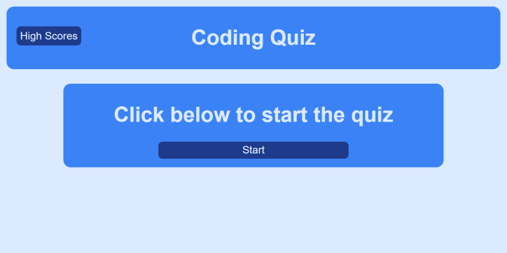
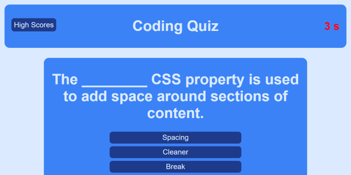
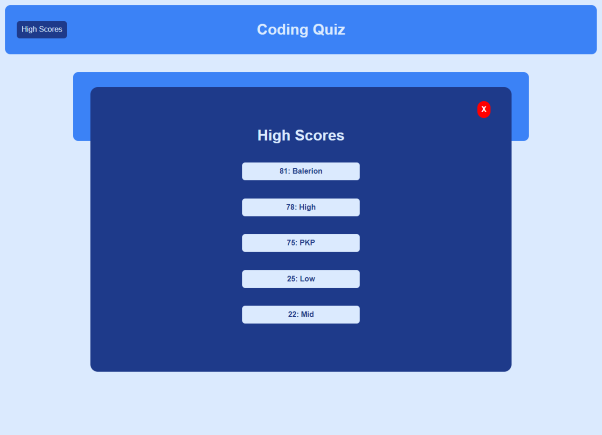

# Project 4 - Multiple Choice Quiz
In the project I created a JavaScript powered web application for a multiple choice quiz about computer coding. The application meets the following requirements:
* The page loads to a button that will start the quiz
* Each question is loaded by finishing the previous
* Wrong answers result in a penalty to the timer
* The game ends when all the questions are answered or the time is up
* When the game is over, the user will submit their name for the high scores list
---
## Where to Find It
The application is deployed [here](https://pikaypi.github.io/multiple-choice-quiz/).

---
## What It Looks Like
| | |
|---|---|
| At the beginning |  |
| In the middle |  |
| At the end |  |

---
## How It Works
When the user clicks on the start button, the timer starts in the top right corner and the first question and it's options are rendered to the display. As the user answers each question the option they selected will turn green or red to indicate a correct or incorrect response respectively. Correct answers will earn the user a point, incorrect answers will subtract 10 seconds from the timer.

The game is over when either the questions have all been answered or the timer gets to 0. Upon the end of the game a form will render for the user to submit their score to the high score board. If the score is high enough to be save, it will be saved to local storage and the high score board will be rendered.